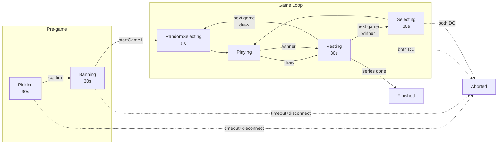

# Chess Opening Duel - Claude Development Guide

## 프로젝트 개요

lichess 오픈소스 기반의 커스텀 체스 게임. 특정 오프닝으로만 승리 가능한 1:1 대결 모드.

### 게임 컨셉
- 1v1 매칭 → 오프닝 밴픽 → **선착 2.5점 (서든데스 포함)**
- 정해진 오프닝 풀에서 각자 밴 → 남은 오프닝으로 대결
- 기본 체스 룰 유지, 승리 조건만 커스텀

### 점수 시스템
클래식 체스 점수 체계 사용:
- **승리**: 1점, **무승부**: 0.5점, **패배**: 0점
- 2.5점 이상 획득하고 상대보다 높은 점수를 가진 플레이어가 시리즈 승자
- 5경기 내 승자 미결정 시 (예: 2.5-2.5 동점) **서든데스** 진행

### 밴픽 플로우
1. **Pick Phase** (30초): 10개 오프닝 중 정확히 5개 선택 (미달 시 Confirm 비활성)
   - 타임아웃: 현재 선택 + 랜덤으로 5개 채워서 자동 확정
2. **Ban Phase** (30초): 상대 픽 중 정확히 2개 밴 (미달 시 Confirm 비활성)
   - 타임아웃: 현재 선택 + 랜덤으로 2개 채워서 자동 확정
3. **Game 1**: 양측 남은 픽 6개 중 랜덤 (밴된 오프닝은 완전 제거)
4. **Game 2~**: 전 경기 패자가 자신의 남은 픽 중 선택 (무승부 시 남은 픽 풀에서 랜덤)

#### Phase 상태

- `Picking` (10): 양측 오프닝 선택
- `Banning` (20): 양측 밴 선택
- `RandomSelecting` (25): Game 1 오프닝 랜덤 선택 중 (카운트다운)
- `Playing` (30): 게임 진행 중
- `Resting` (28): 게임 간 휴식 (30초 타이머, 마지막 게임 포함)
- `Selecting` (40): 패자가 다음 오프닝 선택 중
- `Finished` (50): 시리즈 종료

#### 플로우 다이어그램

**Phase 전환 (메인 플로우):**


**Disconnect 처리 정책:**

| Phase | 1명 DC + timeout | 양측 DC + timeout | 접속 중 + timeout |
|-------|-----------------|------------------|------------------|
| **Picking** | Abort | Abort | 랜덤 채우기 |
| **Banning** | Abort | Abort | 랜덤 채우기 |
| **Playing** | 게임 패배, 시리즈 계속 | Resting에서 abort | — |
| **Selecting** | 랜덤 선택 | Abort | 랜덤 선택 |
| **Resting** | 자동 전환 | Abort | 자동 전환 |

- DC 감지: lila-ws `SeriesClientActor`의 `PostStop` → `SeriesPlayerGone` + 개별 `lastSeenAt` 갱신 (ping 3초 간격)
- DC threshold: 5초 (`isDisconnected = lastSeenAt < now - 5s`)
- Playing/Resting 중 플레이어는 게임 페이지 (Round WS)에 있으므로 series WS 미연결
  - Resting UI에서 `GET /api/series/{id}` 3초 간격 호출로 `lastSeenAt` 갱신

**주요 이벤트:**

| 이벤트 | 발생 시점 | Env.scala 핸들러 |
|--------|----------|------------------|
| `SeriesCreated` | Series 생성 | `timeouts.schedule()` |
| `SeriesPhaseChanged` | Phase 전환 | Banning/Resting: `schedule()`, Playing/Finished: `cancel()` |
| `SeriesAborted` | DC abort | - |
| `SeriesEnterResting` | 게임 종료 후 휴식 진입 | WS로 resting UI 알림 |
| `SeriesEnterSelecting` | Game 2+ 승패 결정 | `timeouts.schedule()` + 클라이언트 리다이렉트 |
| `SeriesDrawRandomSelecting` | Game 2+ 무승부 | 클라이언트 리다이렉트 |
| `SeriesFinished` | 시리즈 종료 (Resting 후) | - |

#### API 엔드포인트
| Method | Path | 설명 |
|--------|------|------|
| GET | `/series/{id}` | 시리즈 상태 조회 (JSON) |
| GET | `/series/{id}/pick` | 밴픽 페이지 (HTML) |
| POST | `/series/{id}/setPicks` | 픽 설정 |
| POST | `/series/{id}/confirmPicks` | 픽 확정 |
| POST | `/series/{id}/timeoutPicks` | 픽 타임아웃 (랜덤 채우기) |
| POST | `/series/{id}/setBans` | 밴 설정 |
| POST | `/series/{id}/confirmBans` | 밴 확정 |
| POST | `/series/{id}/timeoutBans` | 밴 타임아웃 (랜덤 채우기) |
| POST | `/series/{id}/selectNextOpening` | 다음 오프닝 선택 (패자용) |

#### 핵심 파일
```
repos/lila/modules/series/src/main/
├── Series.scala          # 시리즈 모델 (Phase, maxPicks, maxBans 등)
├── SeriesPlayer.scala    # 플레이어 모델 (confirmedPicks, confirmedBans)
├── SeriesOpening.scala   # 오프닝 모델 (source, ownerIndex, usedInRound)
├── SeriesGame.scala      # 게임 결과 모델
├── SeriesApi.scala       # 비즈니스 로직 (타임아웃 처리 포함)
├── SeriesJson.scala      # JSON 직렬화
└── OpeningPresets.scala  # 10개 오프닝 프리셋 정의

repos/lila/ui/series/
├── src/ctrl.ts           # 프론트엔드 컨트롤러
├── src/view.ts           # Snabbdom 뷰
└── css/_pick.scss        # 스타일
```

## 저장소 구조

```
chess-opening-duel/                 # lila-docker 포크 (메인)
├── compose.yml                     # Docker 구성 (간소화)
├── conf/                           # 설정 파일
│   ├── lila.conf                   # lila 설정
│   ├── Caddyfile                   # 웹서버 설정
│   └── lila-ws.conf                # WebSocket 설정
├── docker/                         # Dockerfile들
├── scripts/                        # 헬퍼 스크립트
├── lila-docker                     # 실행 스크립트
└── repos/                          # Git submodules
    ├── lila/                       → chess-opening-duel-lila
    ├── scalachess/                 → chess-opening-duel-scalachess
    └── chessground/                → chess-opening-duel-chessground
```

## 핵심 컴포넌트

### 1. lila (메인 서버)
- **언어**: Scala (Play Framework)
- **역할**: 게임 로직, API, 웹 렌더링
- **주요 경로**:
  ```
  repos/lila/
  ├── app/controllers/      # API 엔드포인트
  │   ├── Lobby.scala       # 로비
  │   ├── Round.scala       # 게임 진행
  │   └── Challenge.scala   # 대결 생성
  ├── app/views/            # HTML 템플릿 (Twirl)
  ├── modules/              # 비즈니스 로직
  │   ├── game/             # 게임 모델
  │   ├── round/            # 라운드 관리
  │   └── challenge/        # 챌린지 시스템
  ├── ui/                   # 프론트엔드 (TypeScript)
  │   ├── lobby/            # 로비 UI
  │   ├── round/            # 게임 화면 UI
  │   └── common/           # 공통 컴포넌트
  └── conf/routes           # URL 라우팅
  ```

### 2. scalachess (체스 엔진)
- **언어**: Scala
- **역할**: 체스 규칙, 변형(Variant), 합법 수 계산
- **주요 경로**:
  ```
  repos/scalachess/src/main/scala/
  ├── variant/              # 체스 변형 정의
  │   ├── Standard.scala
  │   ├── Chess960.scala    # 참고용
  │   └── Crazyhouse.scala  # 참고용
  ├── Game.scala            # 게임 상태
  ├── Situation.scala       # 현재 상황 (승리 조건)
  └── opening/              # 오프닝 데이터
  ```

### 3. chessground (보드 UI)
- **언어**: TypeScript
- **역할**: 체스보드 렌더링, 드래그&드롭
- **주요 경로**:
  ```
  repos/chessground/
  ├── src/
  │   ├── api.ts            # 외부 API
  │   ├── board.ts          # 보드 렌더링
  │   ├── config.ts         # 설정
  │   └── state.ts          # 상태 관리
  └── assets/
      └── chessground.css   # 스타일
  ```

## 개발 명령어

### 환경 시작/중지
```bash
./lila-docker start          # 시작 (첫 실행시 설정)
./lila-docker stop           # 중지
./lila-docker restart        # 재시작
./lila-docker down           # 완전 삭제
./lila-docker logs           # 로그 확인
```

### 코드 변경 반영
```bash
# 프론트엔드 (TypeScript/SCSS) - 자동 재컴파일
./lila-docker ui --watch

# 백엔드 (Scala) - 재시작 필요
./lila-docker lila restart

# Scalachess 변경시 - 로컬 퍼블리시 후 재시작
docker compose exec -w /scalachess lila sbt publishLocal
docker compose restart lila

# 라우트 변경시
docker compose exec lila ./lila.sh playRoutes
```

### 코드 포맷팅
```bash
./lila-docker format
```

### 데이터베이스 리셋
```bash
./lila-docker db
```

### E2E 테스트 (Playwright)

→ [tests/e2e/README.md](tests/e2e/README.md) 참조

## 구현 계획

### Phase 1: 환경 설정 ✅
- [x] GitHub 포크 (chess-opening-duel, lila, scalachess, chessground)
- [x] Submodule 연결
- [x] Full 모드 설정 및 빌드 확인

### Phase 2: 코드베이스 분석 ✅
- [x] 기존 variant 구현 분석 (Chess960, Crazyhouse)
- [x] 게임 생성 → 진행 → 종료 플로우 추적
- [x] Challenge 시스템 이해

### Phase 3: 백엔드 구현 (진행중)
- [ ] OpeningChallenge variant 생성 (scalachess)
- [ ] 오프닝 검증 로직
- [x] Match 모델 (선착 2.5점, 서든데스) - v1.1.0
- [x] 랜덤 오프닝 프리셋 - v1.3.0
- [ ] 밴픽 시스템 - v1.4.0 (계획)

### Phase 4: UI 구현 (진행중)
- [ ] 불필요한 UI 제거 (퍼즐, 대회, 학습 등)
- [ ] 오프닝 밴픽 UI - v1.4.0 (계획)
- [x] 매치 진행 상황 표시 - v1.2.0
- [ ] 브랜딩 변경

### Phase 5: 배포
- [ ] Docker 이미지 빌드
- [ ] 클라우드 배포 (Railway/Fly.io)

### 완료: WebSocket 기반 Disconnect 감지 (v1.4.0)

- lila-ws에 `SeriesClientActor` 추가 → 실시간 disconnect 감지
- `PostStop` → `SeriesPlayerGone(roomId, idx, true)` 발행
- 개별 플레이어 `lastSeenAt` 갱신 (ping 3초 간격, threshold 5초)
- Playing/Resting 중 게임 페이지에서 `GET /api/series/{id}` 3초 간격 호출

## 릴리스 내역

### v1.4.0 - Ban/Pick System (계획)

매치 시작 전 밴픽 시스템으로 전략적 오프닝 선택.

**밴픽 플로우:**
```
[Pre-game Phase - 매치 시작 전]

1. Pick Phase (30초)
   - 10개 프리셋 중 최대 5개 토글 선택
   - 두 플레이어 동시 진행 (턴 없음)
   - 5개 미만 선택 시 랜덤으로 채움

2. Ban Phase (30초)
   - 상대의 픽 중 최대 2개 토글 선택
   - 두 플레이어 동시 진행
   - 2개 미만 선택 시 랜덤으로 채움
   → 결과: 각자 3개 오프닝 보유 (밴된 오프닝은 완전 제거)

[Game 1]
- 양측 남은 픽 6개 중 랜덤 선택

[Game 2~]
- 전 경기 패자가 자기 픽 오프닝 선택 (별도 화면, 30초)
- 타임아웃 또는 무승부 시: 남은 픽 풀에서 랜덤
```

**구현 범위:**

| 영역 | 작업 |
|------|------|
| Match 모델 | picks, bans, phase 필드 추가 |
| 밴픽 API | `/match/{id}/pick`, `/match/{id}/ban` |
| 밴픽 UI | 별도 페이지 `/match/{id}/pick`에서 오프닝 선택/밴 |
| 게임 시작 로직 | 랜덤/패자 선택 분기 처리 |
| 오프닝 선택 UI | 패자가 다음 게임 오프닝 선택 |
| WebSocket | 실시간 밴픽 상태 동기화 |

**예상 데이터 구조:**
```scala
case class Match(
  // 기존 필드...
  phase: Phase,  // Picking | Banning | Playing | Finished
  picks: Picks,  // { white: List[Opening], black: List[Opening] }
  bans: Bans,    // { white: List[Opening], black: List[Opening] }
)
```

**생성/수정 예정 파일:**
```
repos/lila/modules/match/src/main/Match.scala       # phase, picks, bans 추가
repos/lila/modules/match/src/main/MatchApi.scala    # 밴픽 로직
repos/lila/app/controllers/Match.scala              # 밴픽 API (신규)
repos/lila/app/views/match/pick.scala               # 밴픽 UI (신규)
repos/lila/ui/match/                                # 밴픽 프론트엔드 (신규)
repos/lila/conf/routes                              # 라우트 추가
```

### v1.3.0 - Random Opening Presets
- 각 게임이 랜덤 오프닝 프리셋(FEN)으로 시작
- 10개 오프닝 풀에서 매치당 5개 선택 (중복 없음)
- FromPosition variant 사용
- Match Score UI에 오프닝 이름 표시 (테이블 전치)
- 오프닝 링크: `https://lichess.org/opening/{name}` (공백→`_`, 콜론 제거)

**오프닝 프리셋 (ECO 코드 기준):**

| # | ECO | Name | FEN |
|---|-----|------|-----|
| 1 | C89 | Ruy Lopez: Marshall Attack | `r1bq1rk1/2p1bppp/p1n2n2/1p1pp3/4P3/1BP2N2/PP1P1PPP/RNBQR1K1 w - - 0 9` |
| 2 | C54 | Italian Game: Classical Variation, Giuoco Pianissimo | `r1bq1rk1/ppp2ppp/2np1n2/2b1p3/2B1P3/2PP1N2/PP1N1PPP/R1BQ1RK1 b - - 3 7` |
| 3 | D35 | Queen's Gambit Declined: Normal Defense | `rnbqkb1r/ppp1pppp/4pn2/3p4/2PP4/2N5/PP2PPPP/R1BQKBNR w KQkq - 0 4` |
| 4 | E05 | Catalan Opening: Open Defense, Classical Line | `rnbq1rk1/ppp1bppp/4pn2/8/2pP4/5NP1/PP2PPBP/RNBQ1RK1 w - - 0 7` |
| 5 | A22 | English Opening: King's English, Two Knights | `rnbqkb1r/pppp1ppp/5n2/4p3/2P5/2N5/PP1PPPPP/R1BQKBNR w KQkq - 2 3` |
| 6 | B90 | Sicilian Defense: Najdorf Variation | `rnbqkb1r/1p2pppp/p2p1n2/8/3NP3/2N5/PPP2PPP/R1BQKB1R w KQkq - 0 6` |
| 7 | E20 | Nimzo-Indian Defense | `rnbqk2r/pppp1ppp/4pn2/8/1bPP4/2N5/PP2PPPP/R1BQKBNR w KQkq - 2 4` |
| 8 | A56 | Benoni Defense | `rnbqkb1r/pp1ppppp/5n2/2p5/2PP4/8/PP2PPPP/RNBQKBNR w KQkq - 0 3` |
| 9 | B19 | Caro-Kann Defense: Classical Variation | `r2qkbnr/pp1nppp1/2p3bp/8/3P3P/5NN1/PPP2PP1/R1BQKB1R w KQkq - 2 8` |
| 10 | C18 | French Defense: Winawer Variation | `rnbqk1nr/pp3ppp/4p3/2ppP3/3P4/P1P5/2P2PPP/R1BQKBNR b KQkq - 0 6` |

### v1.2.0 - Match Score UI
- 게임 화면에서 crosstable 대신 Match Score 테이블 표시
- 각 게임 결과(1/0/½)를 클릭 가능한 링크로 표시
- "Opening Duel - Game n of 5" 라벨
- 게임 종료 시 실시간 UI 업데이트 (race condition 수정)

### v1.1.0 - Match 모듈
- Match 모델 및 MongoDB 컬렉션
- Challenge에 matchType 필드 추가
- 선착 2.5점 자동 다음 게임 생성 (서든데스 지원)
- Round API에 match 정보 포함

### v1.0.0 - 초기 설정
- lichess 포크 및 submodule 구성
- Docker 개발 환경 설정

## 핵심 파일

### Match 모듈 (v1.1.0)
```
repos/lila/modules/match/
├── src/main/
│   ├── Match.scala           # Match 모델 (선착 2.5점)
│   ├── MatchApi.scala        # 비즈니스 로직
│   ├── MatchRepo.scala       # MongoDB 저장소
│   └── Env.scala             # 의존성 주입
```

### Match Score UI (v1.2.0)
```
repos/lila/app/views/match/ui.scala              # Match Score 컴포넌트
repos/lila/ui/lib/css/component/_match-score.scss # 스타일
repos/lila/ui/round/css/build/round.scss         # CSS import
repos/lila/ui/round/src/round.ts                 # endData() 수정
```

### 수정된 파일
```
repos/lila/app/controllers/Round.scala           # match 데이터 조회
repos/lila/app/views/round/player.scala          # Match Score 렌더링
repos/lila/app/views/round/watcher.scala         # Match Score 렌더링
repos/lila/app/views/game/ui.scala               # sides 함수
repos/lila/modules/round/src/main/RoundApi.scala # JSON에 match 정보
repos/lila/modules/challenge/                    # matchType 필드
```

### 향후 생성 예정
```
repos/scalachess/src/main/scala/variant/OpeningChallenge.scala  # 커스텀 변형
repos/lila/modules/openingduel/                                 # 밴픽 로직
```

## 기술 스택

| 영역 | 기술 |
|------|------|
| 백엔드 | Scala, Play Framework, MongoDB, Redis |
| 프론트엔드 | TypeScript, Snabbdom (Virtual DOM) |
| 체스 로직 | scalachess (Scala) |
| 보드 UI | chessground (TypeScript) |
| 실시간 통신 | WebSocket (lila-ws) |
| 컨테이너 | Docker, Docker Compose |
| 웹서버 | Caddy |

## URL

| 서비스 | URL |
|--------|-----|
| 메인 | http://localhost:8080 |
| DB 관리 | http://localhost:8081 (mongo-express 활성화시) |
| 이메일 테스트 | http://localhost:8025 (mailpit 활성화시) |

## 테스트 계정

Full 모드 설정시 자동 생성됨. 기본 비밀번호: `password`

### TODO: 특수 계정 roles과 Opening Duel 호환성

DB 리셋 시 일부 계정에 랜덤으로 특수 roles (admin, teacher, coach 등)이 부여됨.
특수 roles이 있는 계정은 Opening Duel 시리즈 생성/밴픽 플로우가 정상 동작하지 않을 수 있음.
E2E 테스트에서 `kenneth`, `mateo` 등 특수 계정 사용 시 밴픽 Phase 전환 실패 확인됨.

- [ ] 원인 조사: 어떤 role이 시리즈 플로우를 차단하는지 파악
- [ ] 수정: 특수 계정도 Opening Duel을 정상 이용할 수 있도록 처리

### TODO: Series 게임 Board API 차단

현재 `isBoardCompatible`에 `Source.Series`가 포함되어 있어 Board API로 시리즈 게임을 조작할 수 있음.
E2E 테스트에서 `makeAnyMove` 등 헬퍼가 Board API를 사용하므로 현재는 열어둔 상태.

- [ ] Series 게임에서 Board API 접근 차단 (`isBoardCompatible`에서 `Source.Series` 제거)
- [ ] E2E 헬퍼를 Board API 대신 UI 조작 방식으로 전환
- [ ] 목적: Stockfish 등 외부 엔진 연동을 통한 봇 플레이 방지

## 버전 관리 정책

**Release Branch Workflow** 사용:
```
feature/* ──(squash merge)──► release/{version} ──(merge commit)──► main
```

- **메인 저장소 (chess-opening-duel)**
  - 태그로 버전 관리 (`v1.0.0`, `v1.1.0` 등)
  - main, release/* 브랜치 보호 (직접 push 금지)
  - feature → release: **Squash merge**
  - release → main: **Merge commit**
- **컴포넌트 (lila, chessground, scalachess)**
  - 별도 태그 없이 master에 직접 커밋
  - 메인 저장소가 submodule 커밋을 추적하므로 버전 정보 보존됨

### GitHub Branch Rulesets

| Ruleset | 대상 | 규칙 |
|---------|------|------|
| Protect main | `main` | deletion 금지, force push 금지, PR 필수 (merge commit only) |
| Features to release | `release/*` | deletion 금지, force push 금지, PR 필수 (squash only) |

## 커밋 메시지 규칙

[Gitmoji](https://gitmoji.dev/) 사용. 커밋 메시지 앞에 이모지 붙이기.

| 이모지 | 용도 |
|--------|------|
| ✨ | 새 기능 추가 |
| 🐛 | 버그 수정 |
| 📝 | 문서 추가/수정 |
| ♻️ | 코드 리팩토링 |
| 💄 | UI/스타일 변경 |
| ✅ | 테스트 추가/수정 |
| 🔧 | 설정 파일 변경 |
| 📦 | 패키지/의존성 변경 |
| 🚀 | 배포 |
| 🎨 | 코드 구조/포맷 개선 |
| 🔥 | 코드/파일 삭제 |
| 🚧 | 작업 중 (WIP) |

예시: `📝 Update CLAUDE.md with gitmoji guide`

## Git 워크플로우

### 저장소 클론
```bash
git clone --recursive https://github.com/Ootzk/chess-opening-duel.git
cd chess-opening-duel
```

### 메인 저장소 작업
```bash
# 1. release 브랜치가 없으면 생성
git switch -c release/{next_version}
git push -u origin release/{next_version}

# 2. feature 브랜치에서 작업
git switch -c feature/my-feature
git add .
git commit -m "✨ Add feature"
git push -u origin feature/my-feature

# 3. GitHub에서 PR 생성: feature → release (squash merge)
# 4. 릴리스 준비 완료시 PR 생성: release → main (merge commit)
```

### Submodule 작업 (예: lila)
```bash
cd repos/lila
# master에서 직접 작업
git add .
git commit -m "✨ Add feature"
git push origin master

# 메인 저장소에 submodule 변경 반영
cd ../..
git add repos/lila
git commit -m "📦 Update lila submodule"
```

### Upstream (lichess-org) 동기화
```bash
cd repos/lila
git remote add upstream https://github.com/lichess-org/lila.git
git fetch upstream
git merge upstream/master
```

### 릴리스 절차
```bash
# 1. release → main PR merge (merge commit) 후
# 2. 태그 생성 + GitHub Release 작성
gh release create v{version} --target main --generate-notes --notes "## Summary
- 주요 변경 사항 요약
"

# --generate-notes: PR 기반 자동 변경 내역 생성
# --notes: 추가 설명 (요약)
# --draft: 초안으로 생성 (검토 후 publish)
```

## 참고 자료

- [Lichess GitHub](https://github.com/lichess-org)
- [lila-docker 문서](https://github.com/lichess-org/lila-docker)
- [Chessground 데모](http://localhost:8090/demo.html)

## Claude 개발 가이드라인

### 로컬 정리 절차 (PR 머지 후)
```bash
git fetch --prune                              # 원격 추적 브랜치 정리
git switch release/{version}                   # release 브랜치로 전환
git pull                                       # 최신 변경사항 pull
git branch -D feature/{name}                   # 로컬 feature 브랜치 삭제
git submodule update repos/lila                # submodule 동기화
```

### 커밋 분리 정책
- **정책 구현 (기능)** 과 **버그픽스**는 별도 커밋으로 분리
- lila에서 먼저 커밋/푸시 → 메인 repo에서 submodule 변경사항 커밋

### 커밋 전 테스트
- **매 커밋 직전** 반드시 유저에게 테스트 검수 요청
- 테스트 통과 확인 후 커밋 진행

### 코드 변경 후 재시작
- Scala 변경: `./lila-docker lila restart`
- DB 리셋 필요시: `./lila-docker db`
- 둘 다 필요시: `./lila-docker db && ./lila-docker lila restart`

### UI 빌드
- 특정 모듈만 빌드하지 말고 항상 전체 빌드
- `./lila-docker ui` 또는 `./lila-docker ui --watch`

## 주의사항

- lila 빌드에 12GB+ RAM 필요
- 첫 빌드는 5-15분 소요
- Scala 코드 변경시 반드시 `./lila-docker lila restart`
- scalachess 변경시 `sbt publishLocal` 후 lila 재시작