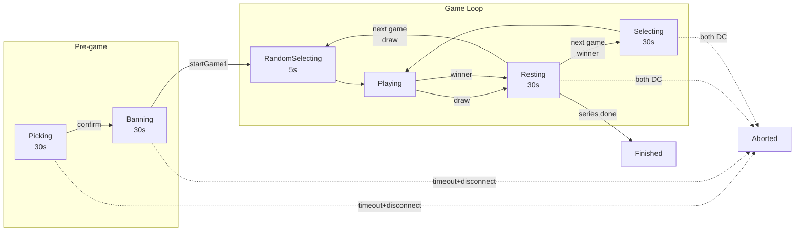

# Chess Opening Duel - Claude Development Guide

## 프로젝트 개요

lichess 오픈소스 기반의 커스텀 체스 게임. 특정 오프닝으로만 승리 가능한 1:1 대결 모드.

### 게임 컨셉
- 1v1 매칭 → 오프닝 밴픽 → **선착 2.5점 (서든데스 포함)**
- 정해진 오프닝 풀에서 각자 밴 → 남은 오프닝으로 대결
- 기본 체스 룰 유지, 승리 조건만 커스텀

### 시리즈 시작 방법
- **Opening Duel with a Friend**: 로비에서 특정 유저에게 챌린지 → 수락 시 시리즈 생성
- **Opening Duel with Anyone**: 로비 hook 등록 → 서버 자동 매칭 (`LobbySyncActor.findCompatible`) → 시리즈 생성
  - Hook 매칭 조건: `isAuth`, `openingDuel`, `variant`, `clock`, `color`, `ratingRange`
  - Rating range: `Gaussian(1500, 350).range(rating, 0.2)` 기반 기본값 또는 유저 설정
  - 매칭 성공 시 `SeriesHookMatch` Bus 이벤트 → 시리즈 생성 + 양측 `/series/{id}/pick` 리다이렉트
- **Opening Duel with Computer**: AI(Stockfish) 상대 시리즈 (싱글플레이어)

### 점수 시스템
- **승리**: 1점, **무승부**: 0.5점, **패배**: 0점
- 2.5점 이상 + 상대보다 높은 점수 → 시리즈 승자
- 5경기 내 미결정 시 (예: 2.5-2.5) **서든데스** 진행

### 밴픽 플로우
1. **Pick Phase** (30초): 10개 오프닝 중 정확히 5개 선택 (미달 시 Confirm 비활성)
   - 타임아웃: 현재 선택 + 랜덤으로 5개 채워서 자동 확정
2. **Ban Phase** (30초): 상대 픽 중 정확히 2개 밴 (미달 시 Confirm 비활성)
   - 타임아웃: 현재 선택 + 랜덤으로 2개 채워서 자동 확정
3. **Game 1**: 양측 남은 픽 6개 중 랜덤 (밴된 오프닝은 완전 제거)
4. **Game 2~**: 전 경기 패자가 자신의 남은 픽 중 선택 (무승부 시 남은 픽 풀에서 랜덤)

#### Phase 상태

- `Picking` (10): 양측 오프닝 선택
- `Banning` (20): 양측 밴 선택
- `RandomSelecting` (25): Game 1 오프닝 랜덤 선택 중 (카운트다운)
- `Playing` (30): 게임 진행 중
- `Resting` (28): 게임 간 휴식 (30초 타이머, 마지막 게임 포함)
- `Selecting` (40): 패자가 다음 오프닝 선택 중
- `Finished` (50): 시리즈 종료

#### 플로우 다이어그램



#### Disconnect 처리

| Phase | 1명 DC + timeout | 양측 DC + timeout | 접속 중 + timeout |
|-------|-----------------|------------------|------------------|
| **Picking** | Abort | Abort | 랜덤 채우기 |
| **Banning** | Abort | Abort | 랜덤 채우기 |
| **Playing** | 게임 패배, 시리즈 계속 | Resting에서 abort | — |
| **Selecting** | 랜덤 선택 | Abort | 랜덤 선택 |
| **Resting** | 자동 전환 | Abort | 자동 전환 |

- DC 감지: lila-ws `SeriesClientActor`의 `PostStop` → `SeriesPlayerGone` + 개별 `lastSeenAt` 갱신 (ping 3초 간격)
- DC threshold: 5초 (`isDisconnected = lastSeenAt < now - 5s`)
- Playing/Resting 중 series WS 미연결 → `GET /api/series/{id}` 3초 폴링으로 `lastSeenAt` 갱신 (atomic `$set`)
- Reconnection banner: 진행 중 시리즈가 있으면 로비에서 phase 무관 일관 배너 표시
  - `currentSeries` > `currentGame` 우선순위 (`home.scala`)
  - "Return to Series" → `pickPage` 컨트롤러가 현재 phase에 맞는 URL로 redirect

#### 주요 이벤트

| 이벤트 | 발생 시점 | Env.scala 핸들러 |
|--------|----------|------------------|
| `SeriesCreated` | Series 생성 | `timeouts.schedule()` |
| `SeriesPhaseChanged` | Phase 전환 | Banning/Resting: `schedule()`, Playing/Finished: `cancel()` |
| `SeriesAborted` | DC abort | - |
| `SeriesEnterResting` | 게임 종료 후 휴식 진입 | WS로 resting UI 알림 |
| `SeriesEnterSelecting` | Game 2+ 승패 결정 | `timeouts.schedule()` + 클라이언트 리다이렉트 |
| `SeriesDrawRandomSelecting` | Game 2+ 무승부 | 클라이언트 리다이렉트 |
| `SeriesFinished` | 시리즈 종료 (Resting 후) | - |

#### API 엔드포인트
| Method | Path | 설명 |
|--------|------|------|
| GET | `/series/{id}` | 시리즈 상태 조회 (JSON) |
| GET | `/series/{id}/pick` | 밴픽 페이지 (HTML) |
| POST | `/series/{id}/setPicks` | 픽 설정 |
| POST | `/series/{id}/confirmPicks` | 픽 확정 |
| POST | `/series/{id}/timeoutPicks` | 픽 타임아웃 (랜덤 채우기) |
| POST | `/series/{id}/setBans` | 밴 설정 |
| POST | `/series/{id}/confirmBans` | 밴 확정 |
| POST | `/series/{id}/timeoutBans` | 밴 타임아웃 (랜덤 채우기) |
| POST | `/series/{id}/selectNextOpening` | 다음 오프닝 선택 (패자용) |

#### 핵심 파일
```
repos/lila/modules/series/src/main/
├── Series.scala          # 시리즈 모델 (Phase, maxPicks, maxBans 등)
├── SeriesPlayer.scala    # 플레이어 모델 (confirmedPicks, confirmedBans)
├── SeriesOpening.scala   # 오프닝 모델 (source, ownerIndex, usedInRound)
├── SeriesGame.scala      # 게임 결과 모델
├── SeriesApi.scala       # 비즈니스 로직 (타임아웃 처리 포함)
├── SeriesJson.scala      # JSON 직렬화
└── OpeningPresets.scala  # 10개 오프닝 프리셋 정의

repos/lila/ui/series/
├── src/ctrl.ts           # 프론트엔드 컨트롤러
├── src/view.ts           # Snabbdom 뷰
└── css/_pick.scss        # 스타일
```

## 저장소 구조

```
chess-opening-duel/                 # lila-docker 포크 (메인)
├── compose.yml                     # Docker 구성
├── conf/                           # lila.conf, Caddyfile, lila-ws.conf
├── docker/                         # Dockerfile들
├── scripts/                        # 헬퍼 스크립트
├── lila-docker                     # 실행 스크립트
└── repos/                          # Git submodules
    ├── lila/                       → chess-opening-duel-lila (Scala, 메인 서버)
    ├── scalachess/                 → chess-opening-duel-scalachess (체스 엔진)
    └── chessground/                → chess-opening-duel-chessground (보드 UI)
```

## 개발 명령어

```bash
./lila-docker start              # 환경 시작
./lila-docker stop               # 중지
./lila-docker lila restart       # Scala 변경 후 재시작
./lila-docker ui                 # 프론트엔드 빌드 (전체, 특정 모듈만 빌드 금지)
./lila-docker ui --watch         # 프론트엔드 watch 모드
./lila-docker format             # 코드 포맷팅
./lila-docker db                 # DB 리셋
docker compose exec lila ./lila.sh playRoutes  # 라우트 변경 시
```

## 테스트

- E2E 테스트 → [tests/e2e/README.md](tests/e2e/README.md) 참조
- 테스트 계정: 기본 비밀번호 `password` (Full 모드 시 자동 생성)

## 릴리스 내역

→ [GitHub Releases](https://github.com/Ootzk/chess-opening-duel/releases) 참조

## 버전 관리 및 Git

**Release Branch Workflow:**
```
feature/* ──(squash merge)──► release/{version} ──(merge commit)──► main
```

- 메인 저장소: feature → release (squash), release → main (merge commit)
- **lila(submodule)는 항상 master에 직접 커밋** → feature 브랜치 절대 금지
- 순서: lila master 커밋/푸시 → 메인 repo에서 submodule 커밋
- 커밋 메시지: [Gitmoji](https://gitmoji.dev/) 사용 (✨ 기능, 🐛 버그, 📦 의존성, ✅ 테스트, 📝 문서 등)
- **기능과 테스트는 별도 커밋**으로 분리
- **매 커밋 직전** 유저에게 테스트 검수 요청

## TODO

### 특수 계정 roles과 Opening Duel 호환성

DB 리셋 시 일부 계정에 특수 roles (admin, teacher, coach 등)이 부여됨.
특수 roles 계정은 시리즈 플로우가 정상 동작하지 않을 수 있음.

- [ ] 어떤 role이 시리즈 플로우를 차단하는지 파악
- [ ] 특수 계정도 Opening Duel을 정상 이용할 수 있도록 처리

### 시리즈 관전 기능

현재 제3자는 개별 게임만 관전 가능하고, 시리즈 전체 흐름(밴픽, phase 진행)은 볼 수 없음.

- `/series/{id}` (JSON): Open — 누구나 조회 가능
- `/series/{id}/pick` (HTML): Auth + 플레이어 전용
- 시리즈 WebSocket: 플레이어 전용 (`mongo.seriesPlayer()` 체크)
- 개별 게임 (`/{gameId}`): Open — 누구나 관전 가능

- [ ] 관전자용 시리즈 페이지 (read-only 밴픽 뷰, 점수판, 현재 phase)
- [ ] 관전자용 WebSocket 접근 허용 (read-only)
- [ ] 시리즈 링크 공유 기능

## 주의사항

### 시리즈 게임 URL 형식
시리즈 프론트엔드(`ui/series/src/ctrl.ts`)에서 게임 페이지 리다이렉트 시 **색상 suffix가 없을 수 있음**:
- `handlePhase` (line 550): `/${gameId}` (suffix 없음)
- `startGameWithId` (line 915): `/${gameId}/${povColor}` (suffix 있음)

→ URL에서 플레이어 색상을 판별하면 안 됨. chessground의 `.cg-wrap` 클래스(`orientation-white`/`orientation-black`)로 판별해야 함.

### Chessground DOM 구조
- `cg-board`, `cg-container`: 커스텀 **HTML 태그** (`createEl('cg-board')`)
- `cg-wrap`: 일반 요소에 붙는 **CSS 클래스** (`element.classList.add('cg-wrap')`, `wrap.ts:26`)
- 셀렉터: `cg-board` (태그), `.cg-wrap` (클래스) — 혼동 주의

## 참고 자료

- [Lichess GitHub](https://github.com/lichess-org)
- [lila-docker 문서](https://github.com/lichess-org/lila-docker)
